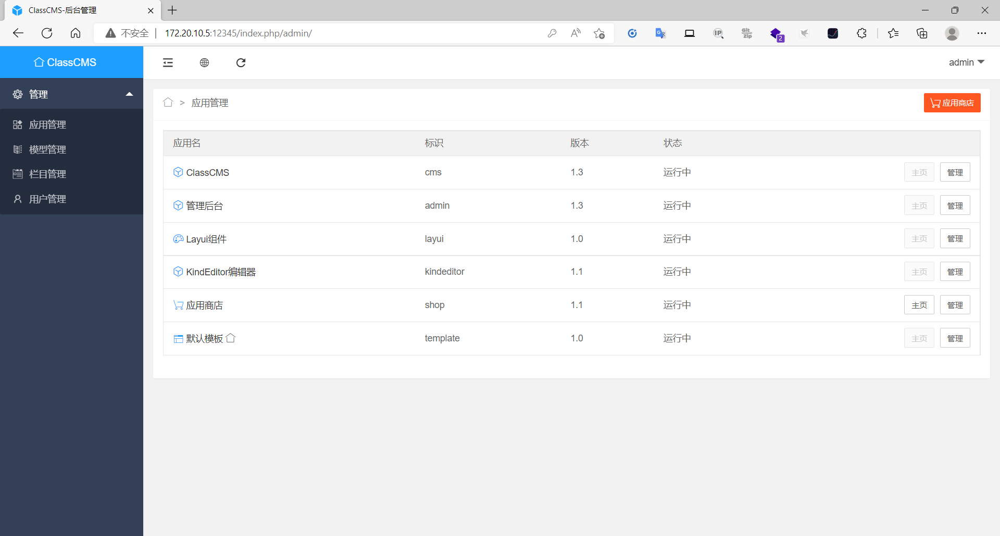
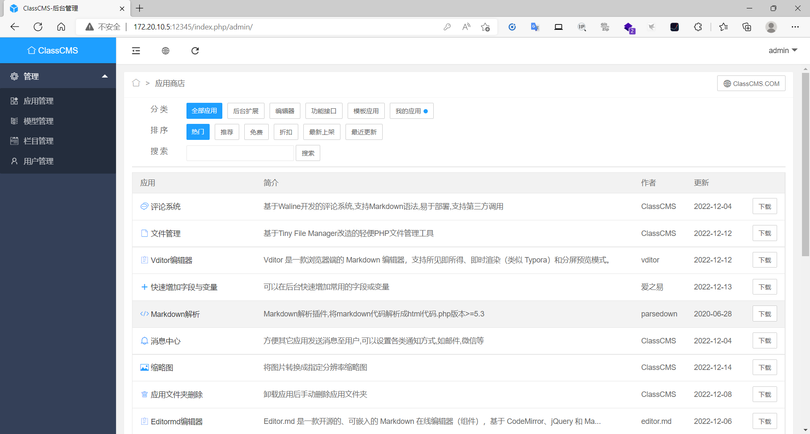
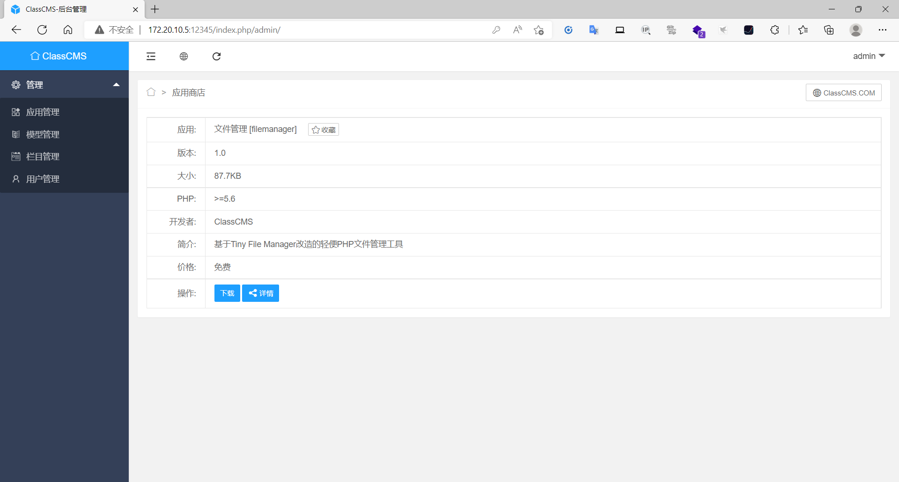
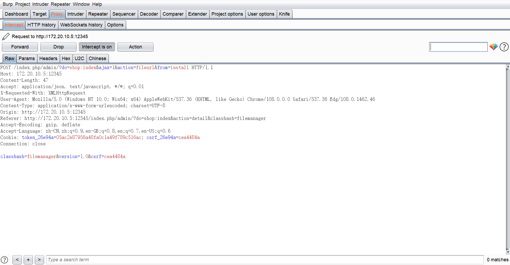
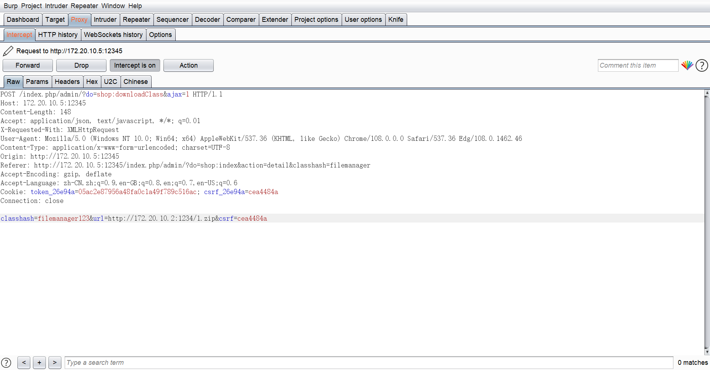
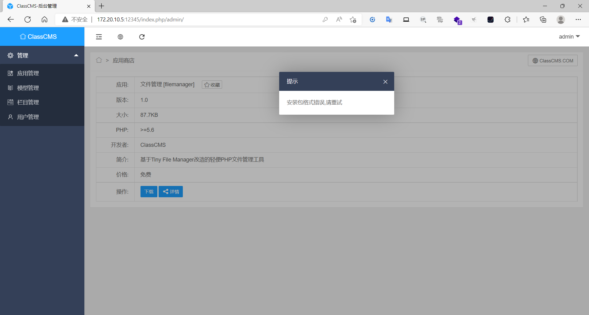
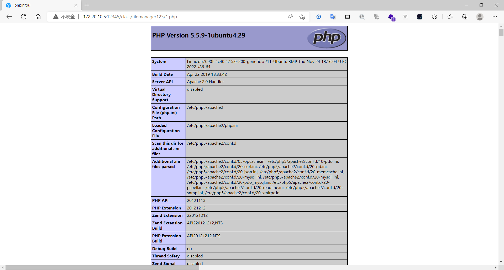

### classcms

```
版本信息：1.3
```

#### 远程文件下载getshell

登录进后台，进入应用商店主页



选择应用下载



点击下载然后抓包



以下请求包放过



然后抓取到以下请求包


可以将classhash修改，随意修改，并将url修改为自己的地址，1.zip里含有一个1.php



将包发送过去后在浏览器看到格式错误，不用理会，实际上文件已经下载到服务器了



webshell路径为

```
/class/[classhash值]/压缩包内php文件
```

