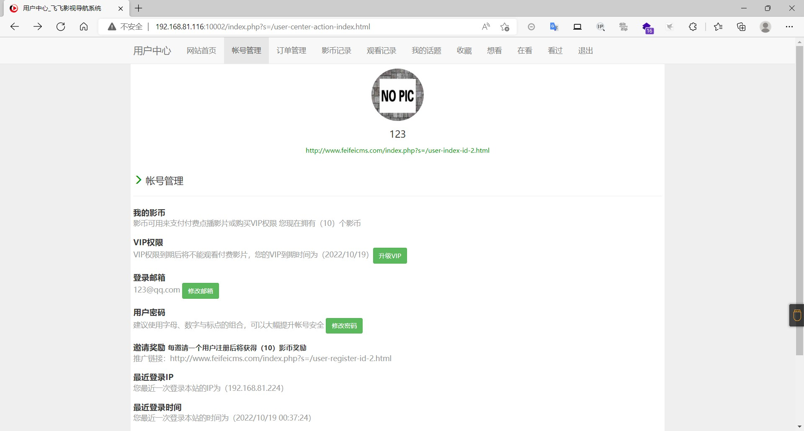
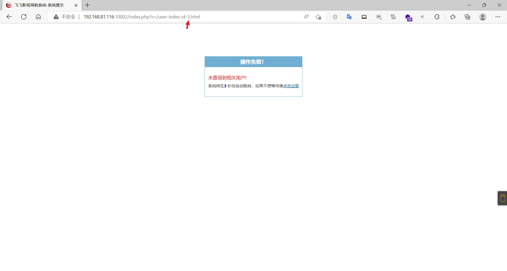
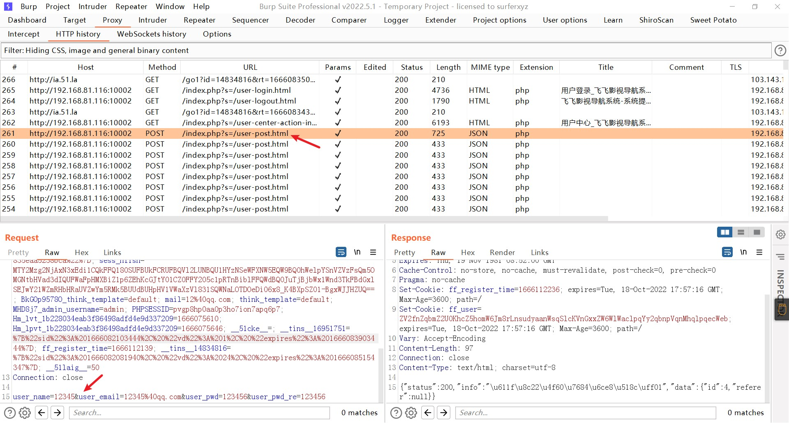
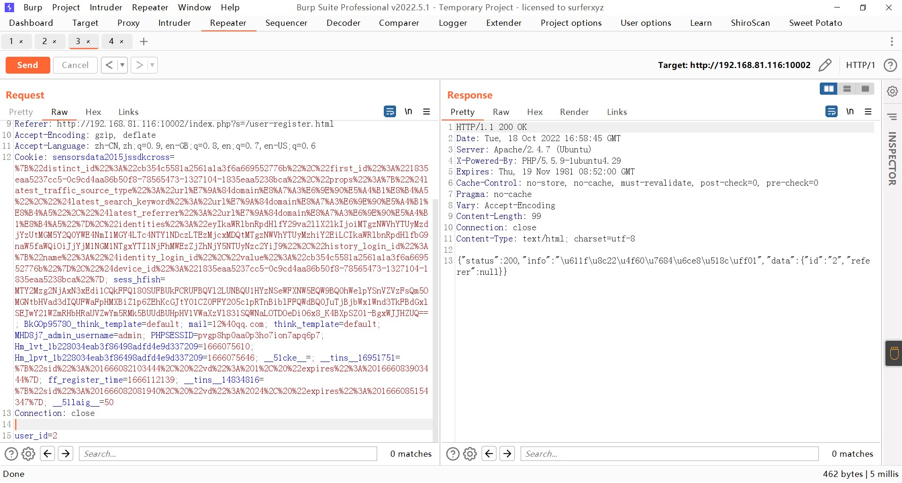
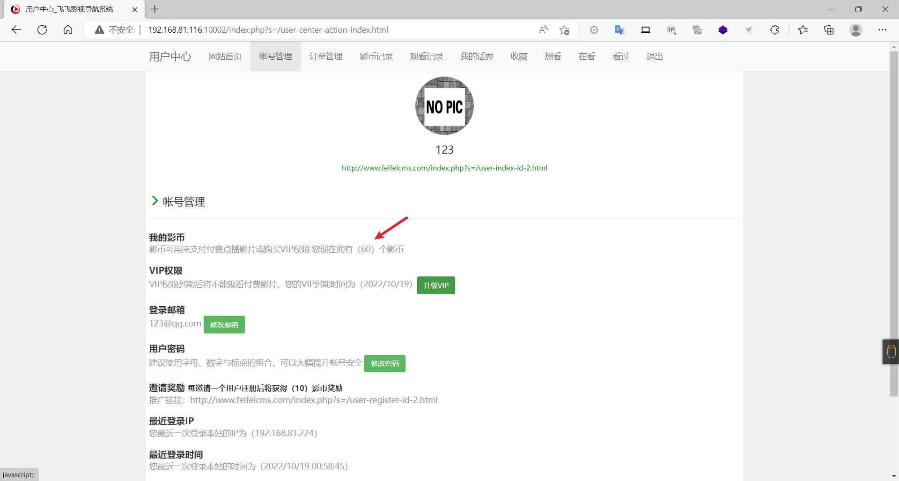

### feifeicms

```
版本信息：4.0.18
```

#### 用户id遍历

注册账号登录之后可以看的自己的id

遍历该id后可以知道有没有被注册


#### 任意用户刷分

在注册后系统会赠送10积分，随意注册一个账号，然后抓取注册的请求包,将请求包的内容修改为user_id=2，2为自己的id


然后重复发送请求，可以看的自己的账号的影币变多了


### 