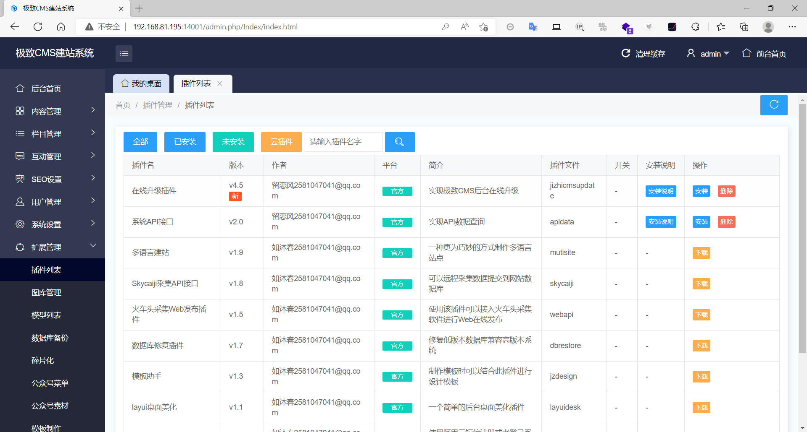
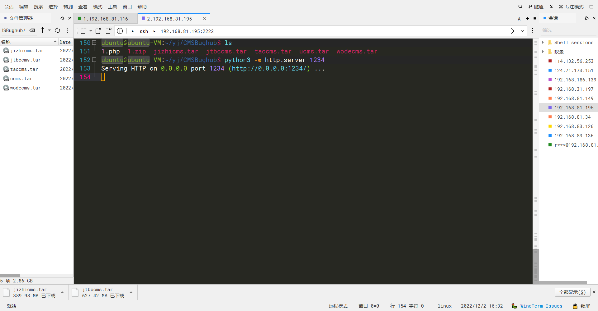
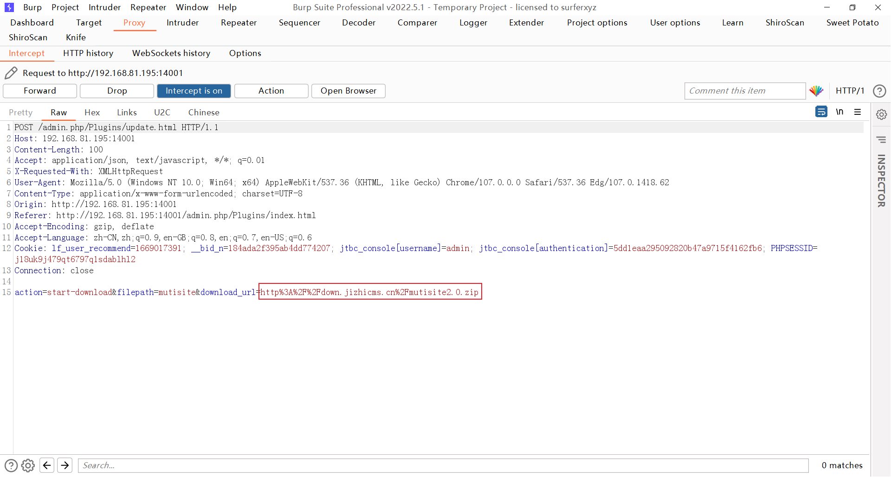
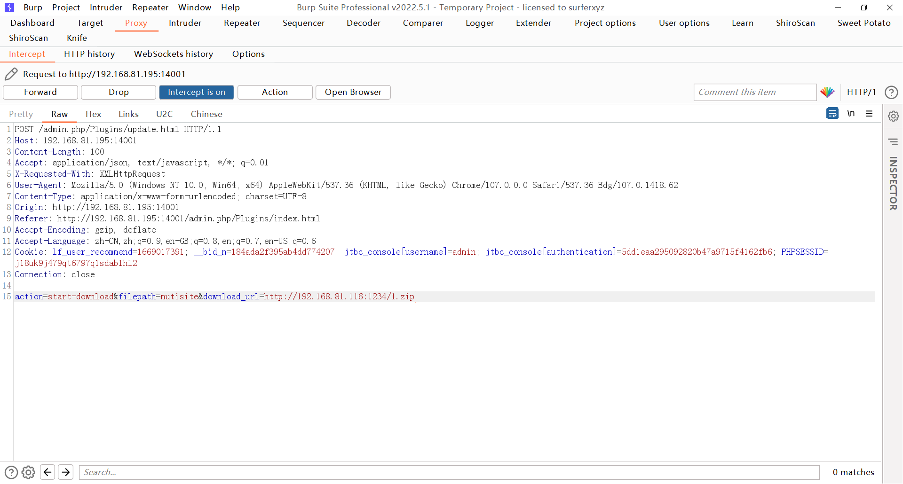
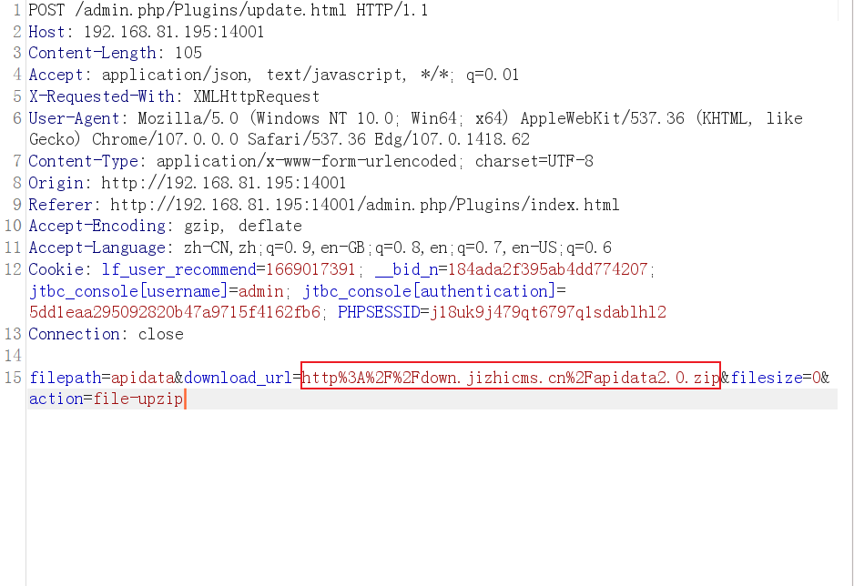
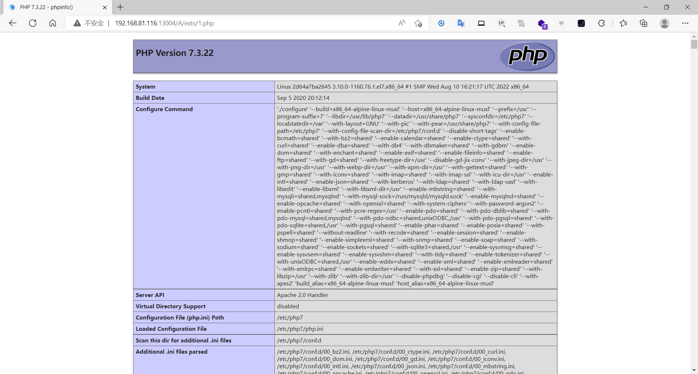

### jizhicms

```
版本信息：1.9.5

# 拉取镜像
docker pull sqlsec/alpine-lamp

# 运行容器 记住要指定密码
docker run -d -p 8080:80 -e MYSQL_ROOT_PASSWORD=root sqlsec/alpine-lamp
```

#### 远程文件下载Getshell

登录进后台后，在扩展管理的插件列表，下载插件然后抓包，



然后在服务器新建一个php文件并将其压缩，放到web目录下是其可以被下载



需要抓取实时的请求包，然后将该请求包的下载url修改为自己服务器的压缩包的url





需要一直修改大概几十个包，直到看到以下请求包



继续修改url，也是需要一直修改，大概几十次，最后webshell路径为

```
/A/exts/1.php
```



